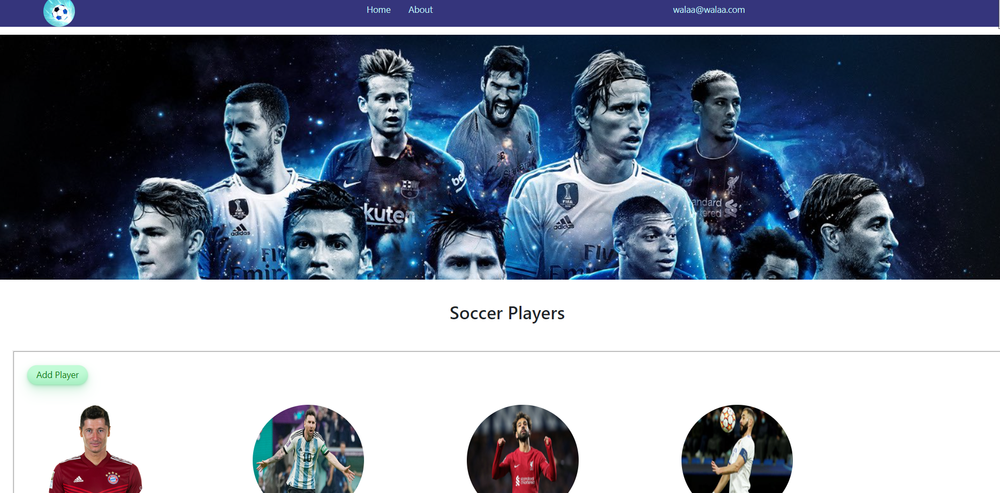
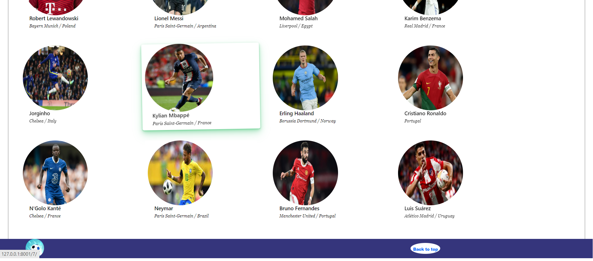
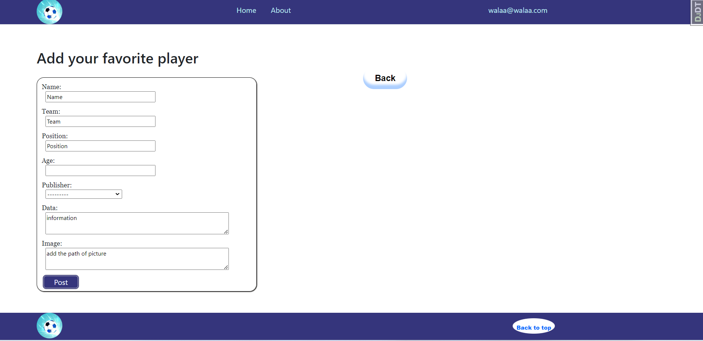
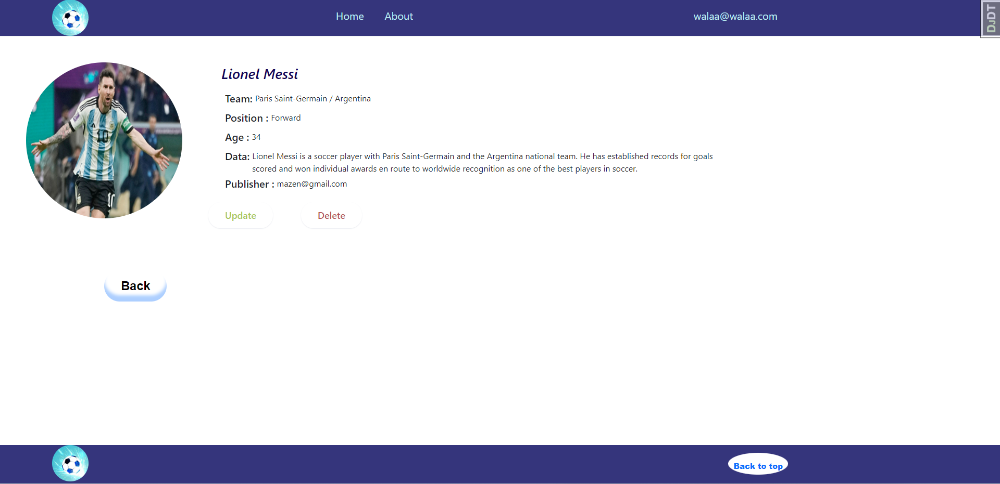
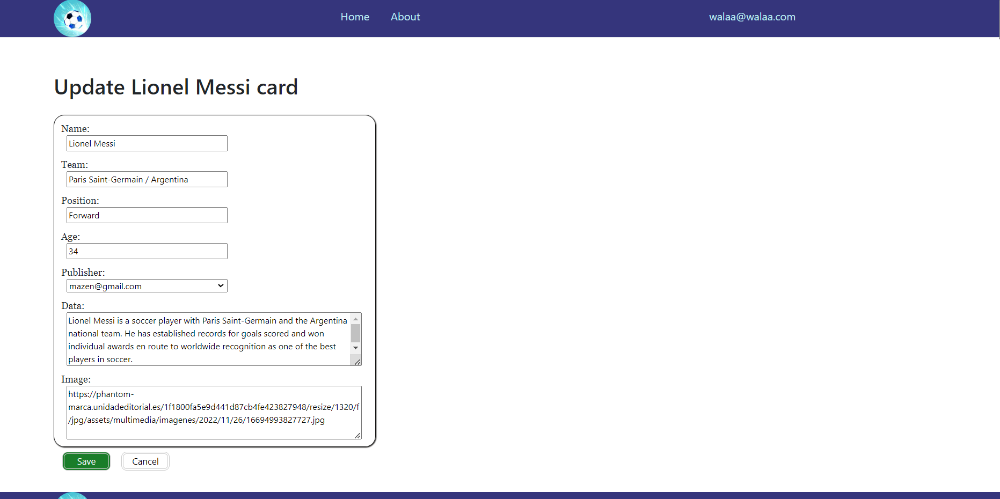
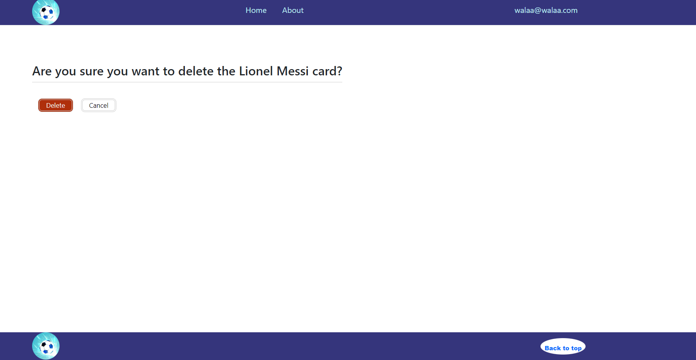

# LAB - Class 23

## Project: DjangoX and Custom Users

### Author: Walaa' Atiyh
### object:

**The aim of this application is to collect information about the best football players as it enables the user to add, update and delete player card. I have developed a full stack application**

### project picture
1. **Home page**
   

2. **Add player page**
   

3. **Detail Card page**

4. **update Card page**
   

5.  **Delete Card page**
   

#### How to initialize/run your application (where applicable)
1. **Create the venv and activate it.**

    `python3.10 -m venv .venv`
    `source .venv/bin/activate`

2. **Installing Django.**

    `pip install django`
    
   or 

   **install  requirements.txt**
   
   `pip3 install -r requirements.txt`

3. **To update the database**

    `python manage.py migrate`

4. **To run the server**

    `python manage.py runserver`

5. **To create an admin user**

    `python manage.py createsuperuser`

  

 

## [pull requests](https://github.com/WalaaAtiah/Djangox_Best-football-players/pull/2)
